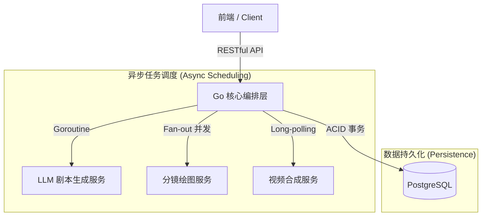

# 🎬 AI-Story: 分布式 AI 视频生成编排系统

> **基于 Go (Gin) 构建的高并发、全异步 AIGC 业务编排后端**


## 📖 项目综述 (Executive Summary)

**AI-Story** 是一个面向 AIGC 场景的视频自动化生成平台。作为系统的核心后端，本项目不局限于传统的 CRUD 业务，而是充当了**异构系统编排者 (Service Orchestrator)** 的角色。

针对 LLM（大语言模型）与 Video Diffusion Model（视频生成模型）存在的**高延迟、低并发、不稳定性强**等工程挑战，本项目采用 **Go** 语言构建了一套**异步非阻塞**的任务调度架构，实现了从剧本生成、分镜并行绘制到视频合成的全链路自动化与高可用。

## 🏗 系统架构设计 (System Architecture)

系统采用分层架构设计，后端作为 **BFF (Backend for Frontend)** 层，向下屏蔽了底层 Python 模型服务的复杂调用协议与不确定性，向上为前端提供统一、标准化的 RESTful API。



## 💡 核心工程亮点 (Engineering Highlights)

### 1. 异步任务编排与状态一致性 (Asynchronous Orchestration)
**挑战**：视频生成模型的推理耗时通常在 30s 到 2min 之间，传统的 HTTP 同步请求极易导致网关超时（Gateway Timeout）或 TCP 连接断开。

**解决方案**：
*   **Fire-and-Forget 模式**：前端发起任务后，后端仅做校验与初始化，**立即返回**任务 ID，释放连接资源，将系统的吞吐量与模型推理耗时解耦。
*   **最终一致性 (Eventual Consistency)**：后端通过轻量级协程（Goroutine）维护长耗时任务，前端通过**状态轮询 (Polling)** 机制获取 `Pending` -> `Generating` -> `Completed` 的状态流转，保证了用户体验的流畅性。

### 2. 基于 Fan-out 模式的高并发吞吐 (Concurrency Pattern)
**挑战**：一个故事通常包含多个分镜（Shots），串行调用绘图模型会导致总耗时线性增长（O(N)），严重影响生产效率。

**解决方案**：
*   利用 Go 语言 **GMP 模型** 的高并发优势，在分镜入库后采用 **Fan-out (扇出)** 模式。
*   后端**瞬间启动 N 个协程**并行请求绘图服务，将分镜生成的总耗时降低为 `Max(T_model)`，最大化利用了底层 GPU 集群的并发能力。

### 3. 数据一致性保障 (ACID Transaction)
**挑战**：业务涉及多步级联操作（LLM 解析 -> 剧本入库 -> 分镜拆解），任何中间环节的失败（如 JSON 解析错误、空数据）都会导致“脏数据”产生（如：故事状态完成，但无分镜）。

**解决方案**：
*   **事务管理**：严格使用 **GORM Transaction** 封装核心链路。确保“分镜数据落地”与“故事状态流转”是一个原子操作。
*   **异常熔断**：实现完整的错误兜底机制，一旦检测到模型端返回异常（HTML 报错、空切片），立即触发 `Rollback` 并将状态置为 `Failed`，保证数据库状态的绝对可信。

### 4. 协议解耦与防御性编程 (Decoupling & Defensive Coding)
**挑战**：底层 Python 模型接口变动频繁，且返回数据格式不可控。

**解决方案**：
*   **DTO 隔离**：设计专用的 **Data Transfer Object (如 VideoGenShot)**，将内部数据库实体 (Entity) 与外部接口参数解耦，实现了数据清洗与协议转换。
*   **健壮性设计**：针对 LLM 可能返回的非 JSON 格式（如 500 HTML 页面），在解析层做了前置校验与日志监控，防止 Panic 导致服务崩溃。

## 🛠 技术栈选型 (Tech Stack)

*   **Core**: Go (Golang) 1.21+ - 选型原因：原生高并发支持，适合 I/O 密集型的编排任务。
*   **Web Framework**: Gin - 高性能、轻量级的 HTTP Web 框架。
*   **ORM**: GORM - 强大的数据映射与事务支持。
*   **Database**: PostgreSQL - 关系型数据库，保证结构化数据的严谨性。

## 🔌 核心接口协议 (Core API Design)

系统遵循 RESTful 设计规范，主要包含以下核心资源：

| 方法 | 路径 | 描述 | 设计意图 |
| :--- | :--- | :--- | :--- |
| `POST` | `/api/story/create` | 创建故事 | 初始化故事，异步触发 LLM 脚本生成 |
| `GET` | `/api/story/:id` | 获取故事详情 | 获取故事的基础元数据 |
| `GET` | `/api/story/:id/shots` | 获取分镜列表 | 根据故事 ID 聚合获取所有分镜，减少请求次数 |
| `GET` | `/api/shot/:id` | 获取分镜详情 | 获取单个分镜的详细配置或图像信息 |
| `POST` | `/api/shot/:id/update` | 更新分镜 | 修改分镜提示词或参数，重新生成做准备 |
| `GET` | `/api/shot/:id/preview` | 获取单张分镜进度 | 轮询单个分镜的生图状态 (Progress Polling) |
| `POST` | `/api/story/:id/mock-gen` | 生成mock数据 | 开发测试专用，快速生成虚拟分镜数据 |
| `GET` | `/api/story/all` | 获取所有资源 | 获取当前用户或系统内的所有资产列表 |
| `POST` | `/api/story/:id/generate-video` | 生成视频 | 提交合成任务，触发后台长耗时渲染进程 |
| `GET` | `/api/story/:id/preview` | 视频预览/轮询 | 供前端轮询视频合成进度或获取最终播放地址 |

---

### 🚀 快速开始 (Quick Start)

1.  **环境准备**: Go 1.18+, PostgreSQL
2.  **配置数据库**: 在 `.env` 或环境变量中配置 DB 连接串。
3.  **启动服务**:
    ```bash
    go mod tidy
    go run main.go
    ```
4.  **接口文档**: 访问 Apifox 在线文档进行调试。
